<div align="center">

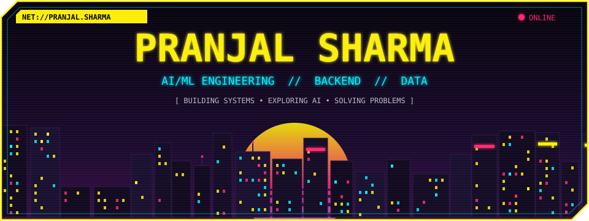


<br/>

<a href="https://github.com/Pranjal-sh-git"></a>
<a href="https://www.linkedin.com/in/pranjal-sharma-75123332a"></a>


</div>

<br/>


I'm an **AI/ML undergraduate** interested in building practical software around intelligent systems.

My interests sit at the intersection of:

```text
Artificial Intelligence + Machine Learning + Backend Engineering + Data  ──▶  Real Products
```

I enjoy going beyond the model itself, understanding the **data pipeline, APIs, backend services, databases, integrations, and deployment** that turn an idea into an actual application.

Currently working on becoming a stronger engineer through:

- Machine Learning & AI Engineering
- Backend & REST API development
- RAG and AI-powered applications
- Data analysis & predictive modelling
- DSA & problem solving
- Software architecture and system design

<br/>


<div align="center">
<table>
<tr>
<td><a href="https://github.com/Pranjal-sh-git/visioniq">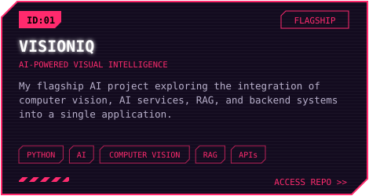</a></td>
<td><a href="https://github.com/Pranjal-sh-git/recurring-expense-anomaly-tracker">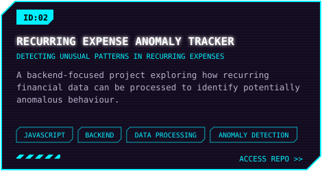</a></td>
</tr>
<tr>
<td><a href="https://github.com/Pranjal-sh-git/surge-pricing-app">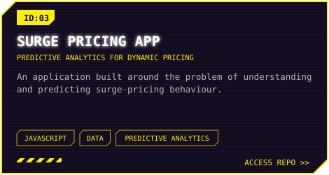</a></td>
<td><a href="https://github.com/Pranjal-sh-git/CineVault">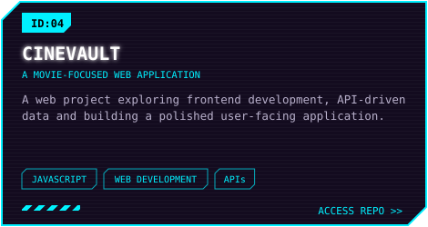</a></td>
</tr>
</table>
</div>

<br/>


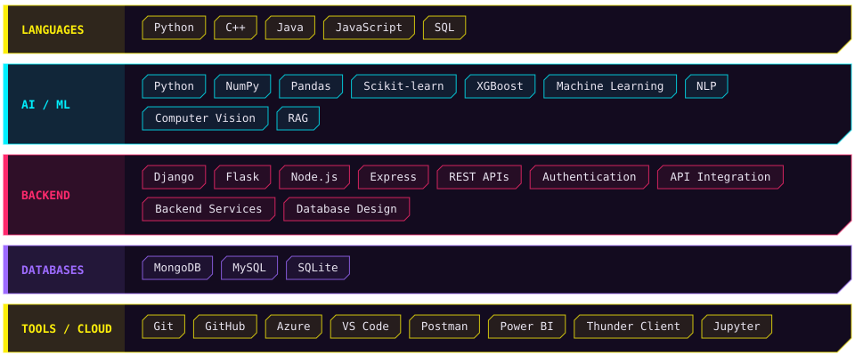

<br/>


I don't want to stop at *"the model works."*
I want to understand the system around it:

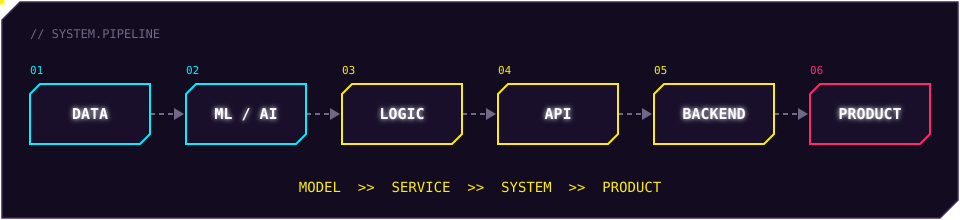

**Model → Service → System → Product.** That's the direction I'm trying to grow toward.

<br/>


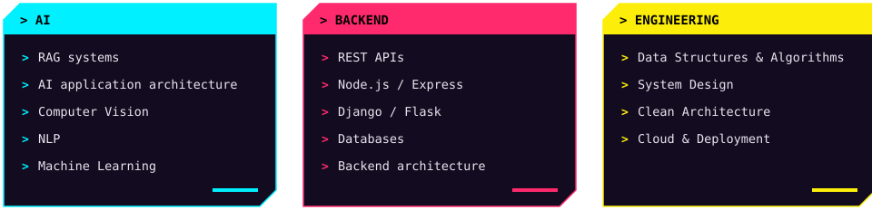

<br/>


I also come from a **visual / creative background**.

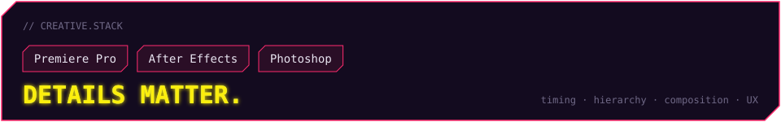

Video editing taught me something that carries into engineering: **details matter.** Timing, hierarchy, composition and user experience all change how something is perceived, whether it's a video, interface, or software product.

<br/>


<div align="center">


</div>

<br/>


Some repositories exist as **learning spaces, coursework, experiments and notes.**
They aren't all meant to be polished products, and that's intentional.

The interesting part of engineering is often the iteration:

```bash
while true; do
  idea && prototype && break && debug && understand && rebuild && ship
done
```

<br/>

<div align="center">
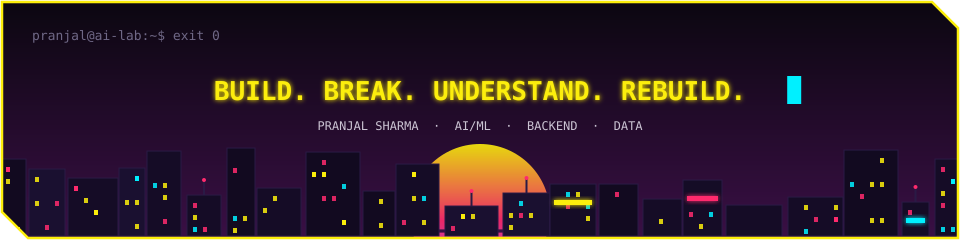
</div>
