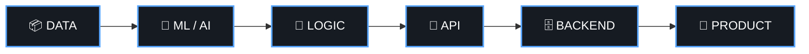

<!-- ═══════════════ HEADER ═══════════════ -->

  

 

<!-- ═══════════════ ABOUT ═══════════════ -->
<h2 align="center">⌬ &nbsp;ABOUT</h2>

I'm an **AI/ML undergraduate** who likes building practical software around intelligent systems.

I enjoy going beyond the model itself, into the **data pipeline, APIs, backend services, databases, integrations and deployment** that turn an idea into a real application.

 

<table align="center">
<tr>
<td align="center" width="25%"><h3>🧠</h3><b>AI & ML</b> Models, RAG, NLP, Vision</td>
<td align="center" width="25%"><h3>⚙️</h3><b>Backend</b> REST APIs, auth, services</td>
<td align="center" width="25%"><h3>📊</h3><b>Data</b> Analysis & predictive modelling</td>
<td align="center" width="25%"><h3>🧩</h3><b>Engineering</b> DSA, system design, architecture</td>
</tr>
</table>

 

<!-- ═══════════════ FEATURED WORK ═══════════════ -->
<h2 align="center">◈ &nbsp;FEATURED WORK</h2>

<table align="center">
<tr>
<td width="50%" valign="top">

### 👁️ VisionIQ
**AI-POWERED VISUAL INTELLIGENCE** · Flagship

Integrates **computer vision, AI services, RAG and backend systems** into a single application.

[**→ View repository**](https://github.com/Pranjal-sh-git/visioniq)

</td>
<td width="50%" valign="top">

### 💸 Recurring Expense Anomaly Tracker
**UNUSUAL-PATTERN DETECTION**

A backend-focused project that processes recurring financial data to flag potentially anomalous behaviour.

[**→ View repository**](https://github.com/Pranjal-sh-git/recurring-expense-anomaly-tracker)

</td>
</tr>
<tr>
<td width="50%" valign="top">

### 📈 Surge Pricing App
**PREDICTIVE ANALYTICS FOR DYNAMIC PRICING**

An application built around understanding and predicting surge-pricing behaviour.

[**→ View repository**](https://github.com/Pranjal-sh-git/surge-pricing-app)

</td>
<td width="50%" valign="top">

### 🎬 CineVault
**MOVIE DISCOVERY WEB APP**

Explores frontend development, API-driven data and building a polished user-facing application.

[**→ View repository**](https://github.com/Pranjal-sh-git/CineVault)

</td>
</tr>
</table>

 

<!-- ═══════════════ STACK ═══════════════ -->
<h2 align="center">⌘ &nbsp;ENGINEERING STACK</h2>

**Languages**

**AI / ML**

**Backend**

`REST APIs` · `Authentication` · `API Integration` · `Backend Services` · `Database Design`

**Databases**

**Tools / Cloud**

`Power BI` · `Thunder Client` · `Jupyter`

 

<!-- ═══════════════ HOW I THINK ═══════════════ -->
<h2 align="center">⟡ &nbsp;HOW I THINK ABOUT BUILDING</h2>

I don't want to stop at *"the model works."*
I want to understand the system around it.

**Model → Service → System → Product**

 

<!-- ═══════════════ EXPLORING ═══════════════ -->
<h2 align="center">◎ &nbsp;CURRENTLY EXPLORING</h2>

<table align="center">
<tr>
<td valign="top" width="33%">

**🧠 AI**
- RAG systems
- AI application architecture
- Computer Vision
- NLP
- Machine Learning

</td>
<td valign="top" width="33%">

**⚙️ Backend**
- REST APIs
- Node.js / Express
- Django / Flask
- Databases
- Backend architecture

</td>
<td valign="top" width="33%">

**🧩 Engineering**
- Data Structures & Algorithms
- System Design
- Clean Architecture
- Cloud & Deployment

</td>
</tr>
</table>

 

<!-- ═══════════════ BEYOND CODE ═══════════════ -->
<h2 align="center">✦ &nbsp;BEYOND CODE</h2>

I also come from a **visual / creative background**.

Video editing taught me something that carries into engineering:

> **Details matter.**
> Timing, hierarchy, composition and user experience change how something is perceived, whether it's a video, an interface or a software product.

 

<!-- ═══════════════ GITHUB SIGNAL ═══════════════ -->
<h2 align="center">▣ &nbsp;GITHUB SIGNAL</h2>

 

<!-- ═══════════════ EXPERIMENTS ═══════════════ -->
<h2 align="center">⚗ &nbsp;OPEN SOURCE & EXPERIMENTS</h2>

Some repositories are **learning spaces, coursework, experiments and notes**.
They aren't all meant to be polished products, and that's intentional.

The interesting part of engineering is often the iteration:

`idea` → `prototype` → `break` → `debug` → `understand` → `rebuild` → `ship`

 

<!-- ═══════════════ FOOTER ═══════════════ -->

Pranjal Sharma · AI/ML · Backend · Data

